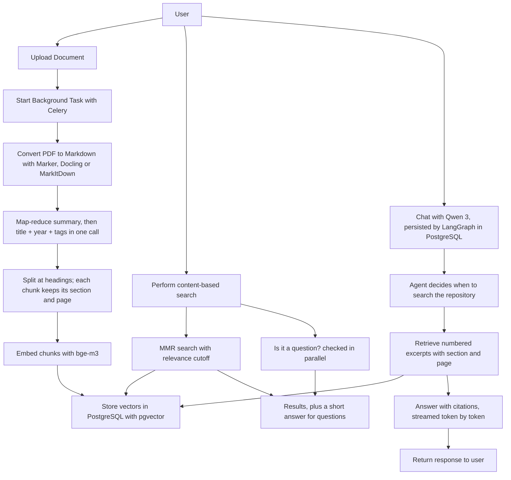

# CATSight.AI Backend

The CATSight.AI Backend is a comprehensive system designed to process, analyze, and facilitate interactive searching and chatting with documents, including scanned PDFs and non-searchable text files.

## Table of Contents

- [Features](#features)
- [Prerequisites](#prerequisites)
- [Installation](#installation)
- [Configuration](#configuration)
- [Running the Application](#running-the-application)
- [How It Works](#how-it-works)
- [Use Case](#use-case)

## Features

- **Content-Based Search**: Search through the actual content of documents, not just titles or keywords, enabling deeper and more relevant queries.
- **OCR Processing**: Automatically extract text from scanned PDFs using Optical Character Recognition (OCR) for enhanced accessibility.
- **Section-Aware Chunking**: Split documents at their headings so every chunk knows its section and page, enabling citations like "*Scholarship Guidelines*, p. 3".
- **Multilingual Embeddings**: Embed chunks with bge-m3, which handles English, Filipino and Cebuano text.
- **Vector Storage with pgvector**: Store and retrieve vector embeddings efficiently using PostgreSQL with the pgvector extension.
- **Streaming Chat**: Answers from Qwen 3 stream word by word, with the source documents and pages shown alongside.
- **Diverse, Relevant Retrieval**: Max-marginal-relevance search with a relevance cutoff returns varied passages instead of near-duplicates, and leaves out unrelated text.
- **Automatic Cataloguing**: Each upload gets a summary, title, issuance year and tags generated by a map-reduce LangGraph workflow.
- **Persistent Chat History**: Store chat interactions in PostgreSQL using LangGraph's checkpointing system, enabling continuous conversations across sessions.

## Prerequisites

- Docker and Docker Compose
- For the PC (GPU) setup: an NVIDIA GPU with the NVIDIA Container Toolkit (Linux) or Docker Desktop + WSL2 GPU support (Windows)

> **Note**: There are two Docker setups: **mac** (CPU-only torch, `docker-compose.mac.yml`) and **pc** (NVIDIA GPU + CUDA torch, `docker-compose.pc.yml`). The scripts pick one automatically (macOS → mac, `nvidia-smi` present → pc, otherwise mac), or you can choose explicitly with `./setup.sh mac` / `./setup.sh pc`.

## Installation

### 1. Clone the Repository

```bash
git clone https://github.com/mjcarnaje/inteldocs.git
cd inteldocs
```

### 2. Pull Required Models

`./setup.sh` pulls these automatically via `./pull-llms.sh` (about 5 GB in total):

| Model | Used for |
|---|---|
| `qwen3:4b-instruct-2507-q4_K_M` | Chat answers and document summaries |
| `qwen3:1.7b` | Short background jobs such as naming chats |
| `bge-m3` | Embeddings for search |

Use `./setup.sh --skip-llms` to start without them and run `./pull-llms.sh` later.

### 3. Build and Start the Containers

Use the provided setup script, optionally naming the platform:

```bash
./setup.sh        # auto-detect
./setup.sh mac    # CPU-only (Mac)
./setup.sh pc     # NVIDIA GPU (Windows/Linux PC)

./setup.sh mac --skip-llms   # skip the Ollama model downloads (fetch later with ./pull-llms.sh)
```

This script will:
- Select the mac (CPU) or pc (NVIDIA GPU) Docker setup
- Clean up old data and rebuild containers
- Pull required models
- Set up the database and create admin user

Alternatively, run Docker Compose manually:

```bash
# Mac (CPU)
docker compose -f docker-compose.yml -f docker-compose.mac.yml up --build

# PC (NVIDIA GPU)
docker compose -f docker-compose.yml -f docker-compose.pc.yml up --build
```

## Configuration

Models and the Ollama endpoint are set in one place, `backend/inteldocs/settings.py`, and can be overridden with environment variables in `docker-compose.yml`:

| Variable | Default | Purpose |
|---|---|---|
| `OLLAMA_BASE_URL` | `http://ollama:11434` | Ollama endpoint |
| `CHAT_MODEL` | `qwen3:4b-instruct-2507-q4_K_M` | Chat and summaries |
| `FAST_MODEL` | `qwen3:1.7b` | Chat titles and quick checks |
| `EMBEDDING_MODEL` | `bge-m3` | Search embeddings (changing it requires re-embedding every document) |
| `OLLAMA_NUM_CTX` | `8192` | Context window requested from Ollama |

If you change a model, also update `pull-llms.sh` and `backend/app/constant/llm.json` (the models users can pick).

## Running the Application

### Using the Setup Script (Recommended)

The easiest way to start the application is using the setup script:

```bash
./setup.sh
```

### Manual Start

If you just want to start existing containers without rebuilding:

```bash
# Mac (CPU)
docker compose -f docker-compose.yml -f docker-compose.mac.yml up

# PC (NVIDIA GPU)
docker compose -f docker-compose.yml -f docker-compose.pc.yml up
```

## How It Works



## Use Case

The system is ideal for environments with extensive document collections requiring efficient search and interaction capabilities. For example, a professor can:

- Upload all academic materials, including scanned documents.
- Search for specific events like "Palakasan 2023" and retrieve all related documents based on content.
- Engage in a conversational interface to ask follow-up questions or seek clarifications, much like interacting with ChatGPT.
