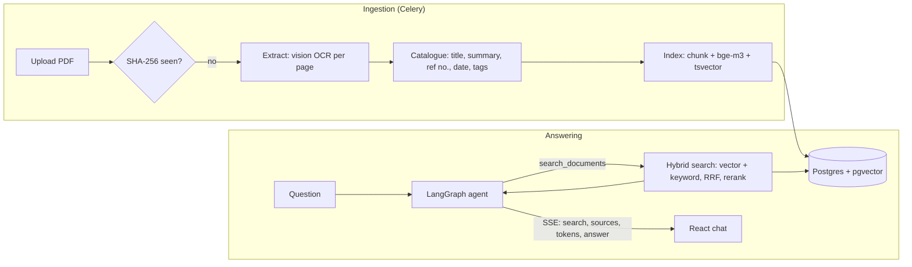

# CATSight.AI

**Ask your documents anything.** CATSight reads scanned university records
(MSU-IIT special orders and Board of Regents resolutions) page by page, catalogues
them, and answers questions with numbered citations that open the exact page.

**Live demo: <https://catsight.mjcarnaje.com>** (one click, no sign-up)


## What it does

- **Reads scans, not just text layers.** Every page is rendered and transcribed by a
  vision model that ignores "UNOFFICIAL COPY" watermarks and letterhead noise. A third
  of the sample PDFs have no text layer at all; the rest have scrambled OCR.
- **Catalogues itself.** One structured call per document writes the title, a summary,
  the reference number ("Special Order No. 01592-IIT, Series of 2023"), the issue
  date, tags, and two questions the document answers.
- **Hybrid retrieval.** Semantic search (bge-m3) and Postgres full-text search are
  fused with Reciprocal Rank Fusion, then reranked. Exact identifiers like
  `SO 1592-2023` and surnames are found even when embeddings blur them.
- **Answers you can check.** A LangGraph agent searches (up to three times), answers
  only from what it found, and cites `[1]`, `[2]` inline. Each citation opens the
  passage and page it came from. Answers stream token by token; you can stop,
  regenerate or edit a question.
- **A pipeline you can watch.** Upload → read → catalogue → index → ready, live on the
  dashboard with per-page progress. Failures keep their progress and show why;
  a retry resumes where it stopped.
- **Built to be a public demo.** One-click guest sessions (private uploads, deleted
  after 24 hours), per-visitor daily limits enforced atomically, a shared page budget,
  signed file URLs, and content-hash dedupe.

## Architecture



| Layer | Stack |
|---|---|
| Frontend | React 18, TypeScript, Vite, TanStack Query, Tailwind CSS, shadcn/ui |
| API | Django 5 + DRF, JWT auth, Server-Sent Events for streaming answers |
| Pipeline | Celery + Redis, pypdfium2 for rendering, LangChain 1.x |
| Agent | LangGraph with a Postgres checkpointer (chat history survives restarts) |
| Search | PostgreSQL 17 + pgvector (exact cosine) and full-text search, fused with RRF |
| Models | OpenRouter: Gemini 3.1 Flash-Lite (OCR, catalogue, answers), bge-m3 (embeddings), Voyage rerank. Or fully local via Ollama |
| Hosting | Docker Compose on a Mac mini behind a Cloudflare Tunnel ([docs/HOSTING.md](docs/HOSTING.md)) |

Cost on OpenRouter: about $0.30 to ingest the 48-document sample corpus (≈180 pages)
and about $0.001 per question.

## Run it locally

Requirements: Docker Desktop and an [OpenRouter key](https://openrouter.ai/settings/keys).

```sh
cp .env.example .env      # paste OPENROUTER_API_KEY
./setup.sh                # builds, migrates, creates your admin account
```

Open <http://localhost:3000>. To add a folder of PDFs as the shared library:

```sh
docker compose cp ~/path/to/pdfs worker:/tmp/pdfs
docker compose exec worker python manage.py ingest /tmp/pdfs
```

### Fully local models

Set `LLM_PROVIDER=ollama` and build with local OCR (marker/docling, ~3 GB image):

```sh
LLM_PROVIDER=ollama LOCAL_OCR=1 docker compose --profile ollama up --build
./pull-llms.sh            # Qwen 3 4B Instruct, Qwen 3 1.7B, bge-m3 (~5 GB)
```

On an NVIDIA machine add `-f docker-compose.gpu.yml` and
`TORCH_INDEX_URL=https://download.pytorch.org/whl/cu124`.

## Configuration

Everything is set through environment variables; [.env.example](.env.example) lists
them all. The important ones:

| Variable | Default | Purpose |
|---|---|---|
| `LLM_PROVIDER` | `openrouter` | `openrouter` or `ollama` |
| `OPENROUTER_API_KEY` | | Give the demo its own key with a credit limit |
| `CHAT_MODEL` / `OCR_MODEL` | `google/gemini-3.1-flash-lite` | Answers and catalogue / page transcription |
| `EMBEDDING_MODEL` | `baai/bge-m3` | 1024-dim, multilingual; changing it requires `manage.py reindex --all` |
| `RERANKER_MODEL` | `voyageai/rerank-2.5-lite` | Empty disables reranking |
| `DEMO_MODE` | `0` | Guest accounts plus per-visitor limits (`DEMO_DAILY_MESSAGES`, `DEMO_DAILY_UPLOADS`, ...) |
| `ALLOWED_EMAIL_DOMAINS` | | Restrict registration, e.g. `g.msuiit.edu.ph` |

## Project layout

```
backend/
  app/services/   llm (provider seam), extraction, summarization, indexing, search,
                  agent (LangGraph), chats, quotas, storage, library
  app/tasks/      the Celery pipeline
  app/views/      REST + SSE endpoints
  tests/          pytest suite (fake embedder, scripted chat model: no API calls)
frontend/src/
  pages/          dashboard, chat, documents, search, tags, settings, landing, auth
  hooks/use-chat  streaming chat state (stop, regenerate, edit)
  lib/            API client, SSE client, React Query hooks
docs/HOSTING.md   Mac mini deployment, backups, updates
scripts/          catsight-remote (manage the deployment over SSH)
```

## Tests

```sh
docker compose exec -T backend python -m pytest      # backend, no model calls
cd frontend && npx tsc --noEmit -p tsconfig.app.json  # frontend types
```
