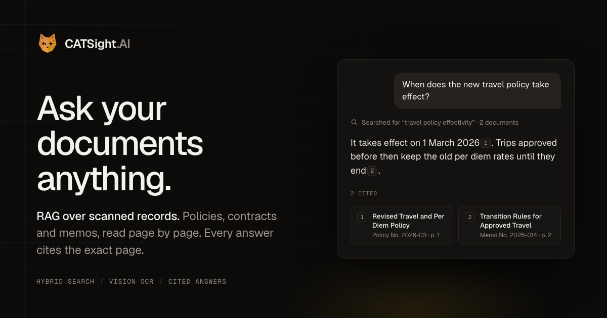
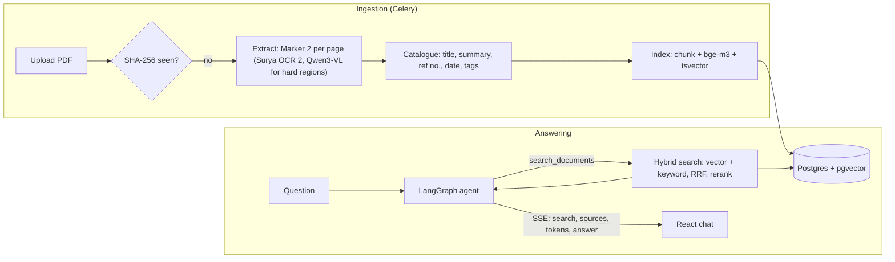

# CATSight.AI

**Ask your documents anything.** CATSight reads scanned records page by page,
catalogues them, and answers questions with numbered citations that open the exact
page. Each organization gets its own library, members, tags and AI provider.

**Live demo: <https://catsight.mjcarnaje.com>** (one click, no sign-up). The demo is
the thesis edition, built for MSU-IIT's special orders and Board of Regents resolutions;
see [Thesis](#thesis).



## What it does

- **Organizations.** Every document, tag and chat belongs to an organization, and
  every search, answer and agent run is scoped to the member's organization. Roles per
  organization (admin, member, guest); the super admin creates organizations and
  admins invite members by email.
- **Bring your own key.** Each organization picks OpenRouter or OpenAI and pastes its
  own key (encrypted at rest, never shown again), or uses the server's Ollama when the
  super admin allows it. Every model is configurable; saving checks the key with a
  real call. Without a provider an organization is read-only.
- **Reads scans, not just text layers.** Every page is rendered and transcribed by a
  vision model that ignores "UNOFFICIAL COPY" watermarks and letterhead noise.
- **Catalogues itself.** One structured call per document writes the title, a summary,
  the document's own reference number, the issue date, tags from the organization's
  list, and two questions the document answers.
- **Hybrid retrieval.** Semantic search (bge-m3) and Postgres full-text search are
  fused with Reciprocal Rank Fusion, then reranked. Exact identifiers like
  `SO 1592-2023` and surnames are found even when embeddings blur them.
- **Answers you can check.** A LangGraph agent searches (up to three times), answers
  only from what it found, and cites `[1]`, `[2]` inline. Each citation opens the
  passage and page it came from. Answers stream token by token; you can stop,
  regenerate or edit a question.
- **A pipeline you can watch.** Upload → read → catalogue → index → ready, live on the
  dashboard with per-page progress. Failures keep their progress and show why;
  a retry resumes where it stopped.
- **Built to be a public demo.** One-click guest sessions in a demo organization
  (read-only, deleted after 24 hours), per-visitor daily limits enforced atomically, a
  shared page budget, signed file URLs, and content-hash dedupe.

## Architecture



| Layer | Stack |
|---|---|
| Frontend | React 18, TypeScript, Vite, TanStack Query, Tailwind CSS, shadcn/ui |
| API | Django 5 + DRF, JWT auth, Server-Sent Events for streaming answers |
| Pipeline | Celery + Redis, pypdfium2 for rendering, LangChain 1.x |
| Agent | LangGraph with a Postgres checkpointer (chat history survives restarts) |
| Search | PostgreSQL 17 + pgvector (exact cosine) and full-text search, fused with RRF |
| Models | Per organization. OpenRouter defaults are open-weight: Qwen3-VL-30B-A3B (catalogue, answers, OCR refinement), BGE-M3 (embeddings), Qwen3-Reranker-8B. OpenAI: gpt-4.1-mini and text-embedding-3-small (1024 dims). Or the server's Ollama |
| OCR | Marker 2 with Surya OCR 2 served by llama.cpp; also Docling, MarkItDown, or page images straight to the vision model |
| Hosting | Docker Compose on a Mac mini behind a Cloudflare Tunnel ([docs/HOSTING.md](docs/HOSTING.md)) |

Cost with the OpenRouter defaults: about $0.30 to ingest the 48-document thesis
corpus (≈180 pages) and about $0.001 per question, paid with the organization's key.

## Run it locally

Requirements: Docker Desktop, and an [OpenRouter](https://openrouter.ai/settings/keys)
or [OpenAI](https://platform.openai.com/api-keys) key for your organization (or local
models, below).

```sh
cp .env.example .env
./setup.sh                # builds, migrates, creates your super admin account
docker compose exec backend python manage.py create_organization "Your organization" --admin you@example.com
```

Open <http://localhost:3000>, sign in, and add the organization's provider and key in
**Settings → AI provider**. Invite people from **Settings → Organization** (with
`EMAIL_HOST` unset, development prints the emails to the backend log, and the link
can always be copied). To add a folder of PDFs to an organization's library:

```sh
docker compose cp ~/path/to/pdfs worker:/tmp/pdfs
docker compose exec worker python manage.py ingest /tmp/pdfs --org your-organization
```

### Fully local models

Build with local OCR (marker/docling, ~3 GB image) and start the server's Ollama:

```sh
LOCAL_OCR=1 docker compose --profile ollama up --build
./pull-llms.sh            # Qwen 3 4B Instruct, Qwen 3 1.7B, bge-m3 (~5 GB)
```

Then, as the super admin, turn on **Ollama** for the organization (Organizations page)
and choose it in **Settings → AI provider**.

On an NVIDIA machine add `-f docker-compose.gpu.yml` and
`TORCH_INDEX_URL=https://download.pytorch.org/whl/cu124`.

## Configuration

Everything is set through environment variables; [.env.example](.env.example) lists
them all. The important ones:

Model providers and keys are per organization, set in the app. The server's settings:

| Variable | Default | Purpose |
|---|---|---|
| `FIELD_ENCRYPTION_KEY` | derived in development | Fernet key that encrypts organizations' API keys; required in production |
| `EMAIL_HOST`, `EMAIL_PORT`, `EMAIL_HOST_USER`, `EMAIL_HOST_PASSWORD`, `DEFAULT_FROM_EMAIL` | console in development | SMTP for invitation emails |
| `OLLAMA_BASE_URL` | `http://ollama:11434` | The server's Ollama, for organizations the super admin allows |
| `EMBEDDING_DIMENSIONS` | `1024` | Every organization's embedding model must return this many values |
| `DEFAULT_TEXT_EXTRACTOR` | `marker` where installed | `marker`, `vision`, `docling` or `markitdown` |
| `DEMO_MODE`, `DEMO_ORG` | `0`, `demo` | Guest accounts in the demo organization plus per-visitor limits there (`DEMO_DAILY_MESSAGES`, `DEMO_DAILY_UPLOADS`, ...) |
| `ALLOWED_EMAIL_DOMAINS` | | Restrict registration; an invitation lifts it |

## Project layout

```
backend/
  app/services/   llm (per-organization providers), organizations, invitations, secrets,
                  extraction, summarization, indexing, search, agent (LangGraph), chats,
                  quotas, storage, library
  app/tasks/      the Celery pipeline
  app/views/      REST + SSE endpoints
  tests/          pytest suite (fake embedder, scripted chat model: no API calls)
frontend/src/
  pages/          dashboard, chat, documents, search, tags, settings, landing, auth
  hooks/use-chat  streaming chat state (stop, regenerate, edit)
  lib/            API client, SSE client, React Query hooks
docs/HOSTING.md   Mac mini deployment (the thesis demo), backups, updates
docs/GENERALIZATION.md  how the thesis system was preserved and generalized
scripts/          catsight-remote (manage the deployment over SSH)
```

## Tests

```sh
docker compose exec -T backend python -m pytest      # backend, no model calls
cd frontend && npx tsc --noEmit -p tsconfig.app.json  # frontend types
```

## Thesis

CATSight began as an undergraduate thesis for MSU-IIT. The thesis and the exact system
it describes live on the `thesis-revision` branch (tags `thesis-defended` and
`thesis-snapshot-2026-10`), and that branch is what the live demo runs. `master` is the
general, multi-organization version; [docs/GENERALIZATION.md](docs/GENERALIZATION.md)
explains the split.

## License

[MIT](LICENSE). The sample MSU-IIT documents in the live demo are not part of this
repository or its license.
